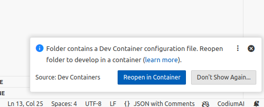

# Definition

A #DevContainer is a _Docker container_ pre-configured with all the tools and dependencies you need for a specific development project. 

# Step-by-step Guide
## Docker

- Visit https://www.docker.com/products/docker-desktop/ to download _Docker for Windows_
- Open the downloaded installer and follow the prompts
- Select add shortcut to the Desktop and click **Ok**

- Click **Close and Restart** to restart your PC. Make sure you save any open file before restarting.
- After the system restarts, click on **Accept**
- Make sure _Use recommended settings_ is selected and click on **Finish**
- You can _Sign up_, or _Sign In_, or _Continue without singing in_

## Visual Studio Code

- Download the editor from https://code.visualstudio.com/Download
- Open the downloaded installer and follow the prompts

- Select the above options and click **Next**
- Click **Install** on the next window and **Finish** to complete the installation

## Git

- Download _Git_ from https://git-scm.com/downloads
- Open the downloaded installer and follow the prompts

- Select _Use Visual Studio Code as Git’s default editor_ on this page and the next.

- Select Override the default branch name for the new repositories and click **Next**

- Check _Enable experimental built-in-file system monitor_ and click **Install**
- Click **Finish** to conclude

## DevContainer

- Open explorer and navigate to where you want to save the project e.g. _Documents_
- Click in the address bar, type `cmd` and press `Enter` to open a `terminal`
- Run `git clone https://github.com/aatinubu/robotics-ai-from-scratch.git` the terminal.
- Right-click on the cloned project **robotics-ai-from-scratch** and click **Open with Code**
- Alternatively, Open _Visual Studio Code_
	- Click on _File_
	- Click _Open Folder_
- Click on **Reopen in Container**

- Alternatively, Click the two arrows on the bottom left corner of _VS Code_ and click **Reopen in Container**

- Wait for the installation to complete.

